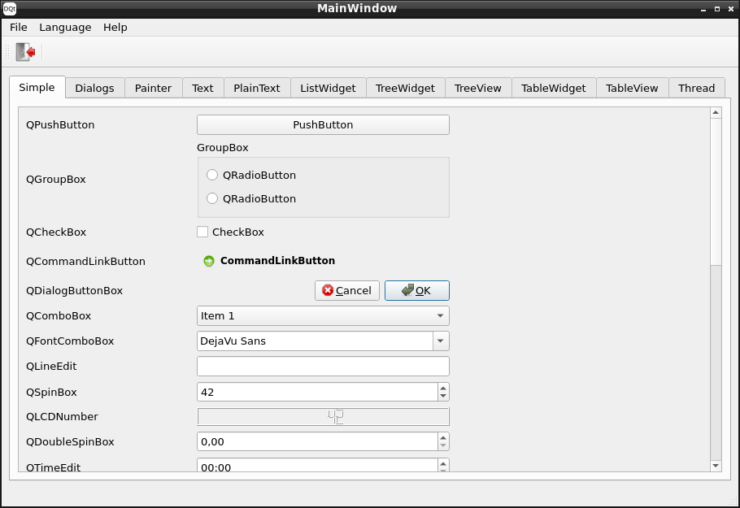

# DQt

DQt contains bindings for using a subset of [Qt](https://www.qt.io/)
with the [D Programming Language](https://dlang.org/). Qt is a library for writing
cross-platform graphical user interfaces. Currently bindings exist for
the Qt modules core, gui, widgets, qml, webenginewidgets, multimediawidgets,
pdfwidgets and dependencies.



## Features

* The bindings use only extern(C++). No additional wrapper in C++ is needed.
* Runtime meta data for signals and slots is generated with CTFE instead
 of a separate program.
* UI files created with Qt Designer can be converted to D code with CTFE.
* Custom item models can be created by inheriting from QAbstractItemModel.
 They can then be used with view classes like QTreeView or QTableView.

## Limitations

* Some structs like QString don't have a default constructor on Windows and have to
 be created using other constructors or a static create function instead.
* const is transitive in D, but not in C++. The bindings and examples
 contain many casts because of this.
* QMap, QSet and QHash are not available in the bindings. Normally they
 should not be needed, because D provides alternatives, but
 QAbstractItemModel::roleNames returns QHash. This could be a problem
 if roleNames has to be used or overridden.
* Qt uses many const reference parameters, which can be used with rvalues
 in C++, but not in D. Extra function overloads are created by a mixin
 to make calling more convenient for these parameters.
* The mangling for many declarations had to be manually set for different
 reasons. There could still be declarations with a wrong mangling, which
 would result in linking errors.

## License

The bindings are licensed under LGPL version 3. See file LICENSE.LGPL3.

For Qt itself see also [Qt Licensing](https://doc.qt.io/qt-6/licensing.html)
and [Licenses Used in Qt](https://doc.qt.io/qt-6/licenses-used-in-qt.html).

The bindings also depend on [dxml](https://github.com/jmdavis/dxml) for
parsing files generated by Qt Designer at compile time. See the license
in the repository for dxml.

## Version

This branch is based on Qt 6.4.2. It should also be compatible with
newer Qt binaries with major version 6.

Branch qt5 contains bindings for major version 5.

## Building

The following examples show how to use DQt:

* examples/helloworld: Minimal program showing a window with label and button.
* examples/examplewidgets: Example using many widgets from Qt and showing them
 in a window with different tabs. It uses UI files created with Qt Designer for
 the layout, which are imported at compile time.
* examples/examplebrowser: Example using QtWebEngine to show a simple web browser.
* examples/exampleqml: Example for using QML.
* examples/mediaplayer: Example for showing a video with QtMultimediaWidgets.
* examples/pdfreader: Example for showing a PDF document with QtPdf.

### Linux

Install the libraries for Qt 6.4.2 using the package manager of the distribution
or the installer from https://www.qt.io/. It was tested with dmd v2.103.1.

You can build and run the example programs using dub:
```
dub run :helloworld
dub run :examplewidgets
dub run :examplebrowser
dub run :exampleqml
dub run :mediaplayer
dub run :pdfreader
```

Alternatively dmd can be used directly:
```
dmd -i -Icore -Igui -Iwidgets \
    -L-lQt6Core -L-lQt6Gui -L-lQt6Widgets -L-lstdc++ \
    -g -run examples/helloworld/main.d
```

### Windows

Install Qt 6.4.2 for MSVC 2019 64-bit (and not MinGW) using
the installer from https://www.qt.io/. It was tested with dmd v2.103.1.

You can build and run the example programs using dub:
```
@set DFLAGS="-L/LIBPATH:C:\Qt\6.4.2\msvc2019_64\lib"
@set PATH=C:\Qt\6.4.2\msvc2019_64\bin;%PATH%
dub run --compiler=dmd --arch=x86_64 :helloworld --build-mode=allAtOnce
dub run --compiler=dmd --arch=x86_64 :examplewidgets --build-mode=allAtOnce
dub run --compiler=dmd --arch=x86_64 :examplebrowser --build-mode=allAtOnce
dub run --compiler=dmd --arch=x86_64 :exampleqml --build-mode=allAtOnce
dub run --compiler=dmd --arch=x86_64 :mediaplayer --build-mode=allAtOnce
dub run --compiler=dmd --arch=x86_64 :pdfreader --build-mode=allAtOnce
```

Alternatively dmd can be used directly:
```
@set PATH=C:\Qt\6.4.2\msvc2019_64\bin;%PATH%
dmd -i -m64 -Icore -Igui -Iwidgets ^
    -L/LIBPATH:C:\Qt\6.4.2\msvc2019_64\lib ^
    Qt6Core.lib Qt6Gui.lib Qt6Widgets.lib ^
    -g -run examples\helloworld\main.d
```

### Other platforms

The library can also be built for OSX and Android, but is less tested
for these platforms. Other platforms supported by Qt and a D compiler
could also work.

## QObject

Many classes in Qt inherit from [QObject](https://doc.qt.io/qt-6/qobject.html).
Those classes can define [signals and slots](https://doc.qt.io/qt-6/signalsandslots.html),
which are special member functions. Signals can be emitted by objects
when something changes or happens. Slots allow to react to signals by
connecting them. Slots can even run on a different thread than the
thread emitting the signal.

Qt uses meta data about classes inheriting from QObject for signals, slots
and other functionality. In C++ the classes have to use the macro Q_OBJECT,
which declares prototypes for accessing the meta data.
The [Meta-Object Compiler](https://doc.qt.io/qt-6/moc.html) will then
scan the source code and generate the meta data as another source file.
DQt uses the string mixins Q_OBJECT and Q_OBJECT_D instead. Q_OBJECT
just declares the prototypes like the macro in C++. Q_OBJECT_D also
generates the meta data itself using templates and CTFE, but this
currently only contains a subset of meta data. Signals and slots are
recognized using the UDAs QSlot and QSignal. Signals for classes implemented
in D also need an implementation with the mixin Q_SIGNAL_IMPL_D.

Signals can be connected using different options. The first option is
to connect a signal of one object to a slot of another object:
```
QObject.connect(pushButton.signal!"clicked", window.slot!"close");
```
Classes can also contain multiple signals or slots with the same name,
but different parameter types. The connect function tries to find
a unique pair of signal and slot with compatible parameter types.
If multiple pairs are possible, the ambiguity can be resolved by providing
the the parameter types as in obj.signal!("valueChanged", int).

It is also possible to connect a signal to a delegate:
```
QObject.connect(action.signal!"triggered", obj, (){
    ...
});
```
The second parameter obj is used to restrict the lifetime of the connection.
Once obj is deleted, the connection will be removed. The caller has to
ensure, that the GC does not free memory referenced by the delegate.

Signals and slots can also be connected automatically by name for
layouts designed in Qt Designer.

## Memory management

Objects can be created using normal new or cpp_new from core.stdcpp.new_.
Qt will sometimes automatically delete objects. Those objects have to be
created with cpp_new.

Objects created with new are freed by the GC, but the GC can not see
references managed by Qt.

## Qt Designer

[Qt Designer](https://doc.qt.io/qt-6/qtdesigner-manual.html) is a program
for designing graphical user interfaces for Qt Widgets. It is also integrated
in the IDE Qt Creator. The layout is saved in XML files with the extension .ui.
For C++ projects they are converted to C++ code as part of the built process.
DQt contains the module qt.widgets.ui, which converts them to D code at
compile time instead. The file is parsed at compile time with
[dxml](https://github.com/jmdavis/dxml).

The content of the .ui files is accessed using the import expression.
It searches for the a file in directories provided with the dmd option -J.
Struct UIStruct in module qt.widgets.ui is a template, which gets a
filename as template argument. It contains members for all widgets in
the .ui file. The member function setupUi initializes all members.
As an alternative to UIStruct the function generateUICode can be used to
generate D code for the layout, which can be used in a mixin.
It is used by UIStruct internally.

## Binding generator

The bindings have been generated with [cppconv](https://github.com/tim-dlang/cppconv)
with manual changes.

## Alternatives

For other libraries making Qt available in D see [QtE5](https://github.com/MGWL/QtE5),
[dqml](https://code.dlang.org/packages/dqml) or
[QtD](http://www.dsource.org/projects/qtd).
You can also find other GUI libraries for D here:
https://code.dlang.org/?sort=updated&category=library.gui
